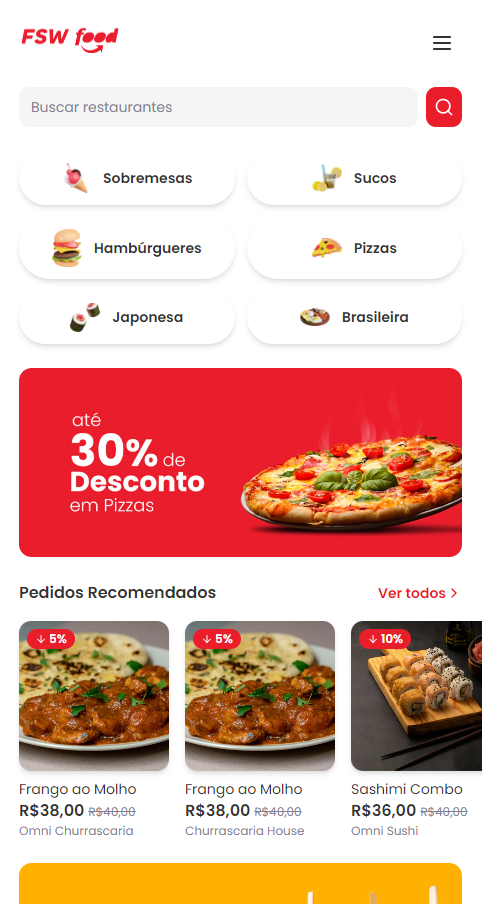

<p align="center">
  <h1 align="center">FSW 4.0 - Foods</h1>
</p>

<p align="center">
  <a alt="ReactJS">
    
  </a>
  <a alt="NextJS">
    
  </a>
  <a alt="TypeScript">
    
  </a>
  <a alt="TailwindCSS">
    
  </a>
  <a alt="ShadcnUI">
    
  </a>
  <a alt="Figma">
     
  </a>
  <a alt="Prisma">
    
  </a>
  <a alt="PostgreSQL">
    
  </a>
</p>

<p align="center">
  <a href="#tecnologias">Tecnologias</a> •
  <a href="#projeto">Projeto</a> •
  <a href="#extras">Extras</a> •
  <a href="#layout">Layout</a>
</p>

<br>

<div align="center">
  
  
  
</div>
<div align="center">
  
  
  
</div>

<h4 align="center">
  
  [Ver projeto](https://fsw-foods-gabriel-centeio-freitas-projects.vercel.app/)
</h4>

## 🚀 Tecnologias<a id="tecnologias"></a>

Esse projeto foi desenvolvido com as seguintes tecnologias:

- ReactJS
- NextJS
- Typescript
- TailwindCSS
- ShadcnUI
- Figma
- Prisma
- PostgreSQL

## 💻 Projeto<a id="projeto"></a>

Projeto de um clone do IFood, desenvolvido durante o evento FSW 4.0 da Full Stack Club. A aplicação foi desenvolvida pensando, principalmente, em sua utilização por usuários de dispositivos móveis. Ela possui funcionalidades como:

- Login com o Google
- Adicionar produtos ao carrinho
- Realizar pedidos
- Consultar histórico de pedidos
- Pesquisar por restaurantes
- Favoritar restaurantes

Caso queira ver o projeto, clique [aqui](https://fsw-foods-gabriel-centeio-freitas-projects.vercel.app/).

### 🔧 Executando localmente

Após clonar o repositório, acesse a pasta do projeto e inicie o servidor de desenvolvimento:

```bash
npm run dev
# ou
yarn dev
# ou
pnpm dev
# ou
bun dev
```

Acesse [http://localhost:3000](http://localhost:3000) para visualizar a aplicação.

## ⭐ Extras<a id="extras"></a>

Lista de funcionalidades extras que adicionei ao projeto:

- Ao visualizar a página de um produto, é recomendado ao usuário outros produtos da mesma categoria

## 🔖 Layout<a id="layout"></a>

Você pode visualizar o layout do projeto através [DESSE LINK](https://www.figma.com/file/uQIgYk6xDRWgjHCjlaDYBo/[LIVE]-FSW-Foods?type=design&node-id=381-7368&mode=design&t=GBKpxvYfSo28poYj-0).
